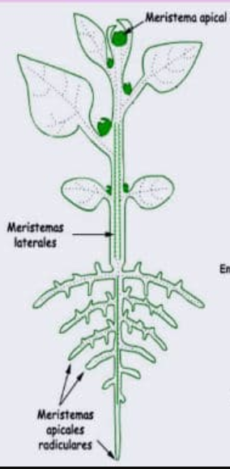

# LA CÉLULA VEGETAL

[Vídeo](https://www.youtube.com/watch?v=FJx0auAdQsw)

La célula es la unidad funcional y estructural de los seres vivos. Es la porción más pequeña con vida propia. Existen dos tipos de organización celular:

* **Células Procariotas**: Carecen de núcleo claramente diferenciado y orgánulos internos. El material genético está formado por un ADN simple. A este grupo de células pertenecen las bacterias.
* **Células Eucariotas**: Tienen núcleo y el  material genético se encuentra en forma de cromosomas.

  
La célula vegetal, aunque es similar a la célula animal, se caracteriza por presentar algunas estructuras ausentes en las células animales tales como la pared celular, las vacuolas y los cloroplastos.

* **Pared celular**: Es una capa o estructura rígida cuya función es proteger a la membrana plasmática y dar rigidez y forma a la célula.
* **Cloroplastos**: Son orgánulos característicos de la célula vegetal pues en ellos tiene lugar el proceso de la fotosíntesis. 
* **Vacuola**: Son orgánulos que pueden ocupar hasta el 90% de toda la célula, tienen función de almacenamiento, puede almacenar agua, sales minerales y otros nutrientes. 
  

# LOS TEJIDOS VEGETALES

Las plantas al igual que los demás seres vivos como los animales también poseen células, el conjunto de células forman tejidos, el conjunto de tejidos forman un órgano. En el caso de una planta los órganos son sus hojas, su tallo, su raíz, sus flores...

## Tejidos meristemáticos

También llamados de crecimiento. Son los tejidos que se encuentran en una planta joven que está en pleno crecimiento. Responsables del crecimiento de la planta. Originan los demás tejidos.
* **EMBRIONARIO**: presentes en las semillas y cuándo éstas germinan.
* **MERISTEMO APICAL**: responsables del crecimientos en longitud de la planta. Se localizan en el extremo de la raíz y la planta.
* **MERISTEMO LATERAL (cambium)**: responsables del crecimiento en grosor, se va a encontrar en el tallo. Se distinguen dos tipos:
  * *Cambium vascular*: produce el tejido conductor. Es el responsable del engrosamiento del vegetal. En las plantas leñosas es la capa de tejido meristemático entre el xilema y el floema.
  * *Cambium suberógeno*: produce el suber o corcho que es la corteza protectora de la planta. Formado por células muertas.

## Tejidos protectores

Son aquellos tejidos encargados de proteger a la planta. Existe dos tipos:

* **Epidermis**: es la capa más externa del vegetal y de las hojas. Se encuentra en plantas herbáceas.
* **Peridermis o súber**: reemplaza a la epidermis en los tallos y raíces de las plantas leñosas (corcho).

## Tejidos conductores

El sistema vascular lo forman dos tipos de tejidos conductores:
* **Xilema**: Es el encargado de hacer circular la savia bruta, el agua y las sales minerales absorbidas desde la raíces de las hojas.
* **Floema**: Son los vasos encargados de distribuir la savia elaborada producida en las hojas, es decir, las sustancias alimenticias resultado de la fotosíntesis. 

## Tejidos fundamentales

* **Colénquima**: sostén de órganos jóvenes en crecimiento. 
* **Esclerénquima**: sostén de partes del vegetal que han dejado de crecer, ya están desarrolladas.
* **Parénquima**: Es el mas abundante en todo el vegetal. Se localiza en todos los órganos y tiene gran variedad de funciones dependiendo de dónde se encuentre: fotosíntesis en la hoja, almacenamiento de reservas en raíz y tallo (p.ej. La patata que es un tallo y almacena almidón), regeneración de tejidos (cicatrización de heridas)...

