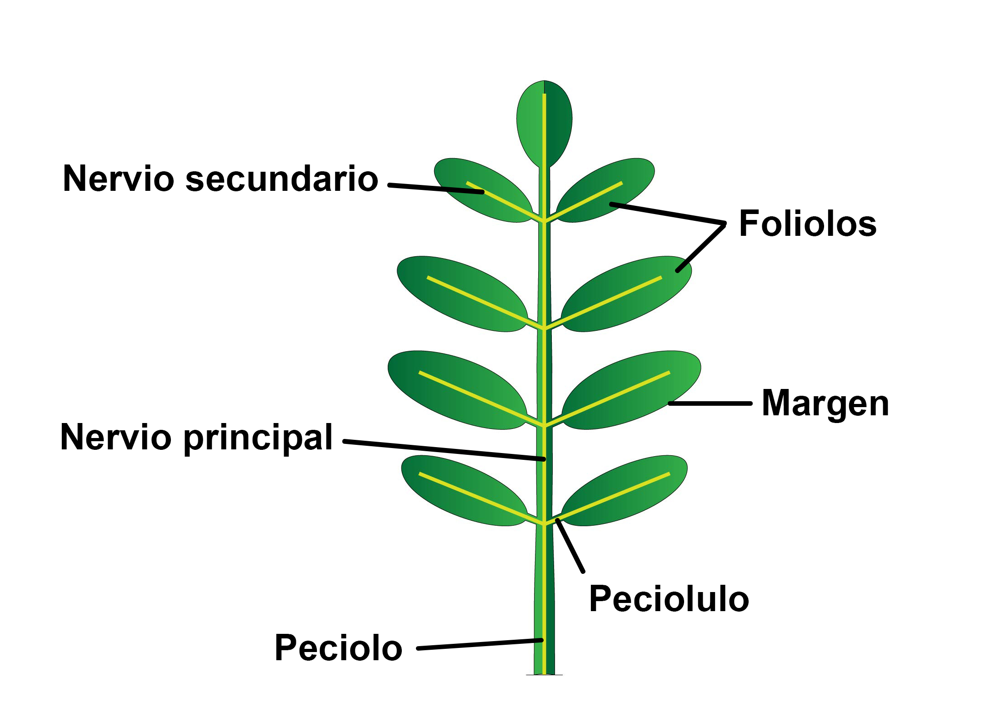
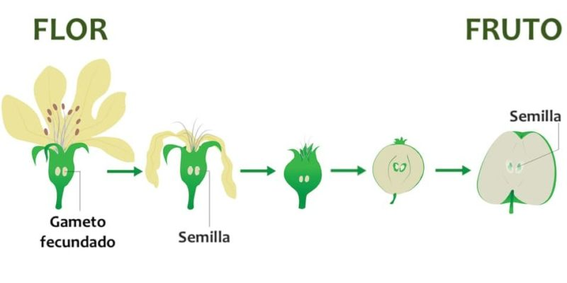

# MORFOLOGÍA Y ESTRUCTURA DE LAS PLANTAS.

Las plantas, de forma general, están compuestas por el aparato vegetativo: raíz, tallo y hojas y por el aparato reproductor, constituido por la flor que da origen al fruto y que a su vez porta en su interior la semilla. 

## La raíz

La raíz es un órgano que cumple las siguientes funciones:

* Fija la planta al suelo.
* Absorbe el agua y elementos minerales contenidos en el suelo
* Acumulas, a veces, sustancias de reserva.

### TIPOS DE RAÍCES

* Pivotantes o axonomorfas:Judía, naranjo, limón
* Fasciculada: Cebolla, ajo...
* Ramificada: perejil
* Nabiforme: Zanahoria, rábano..
* Tuberosa: boniato...
* Adventicias o aéreas: Maíz, fresa, hiedra...

## El tallo

Es un órgano generalmente aéreo, que constituye el eje de la planta, sostiene las hojas, conduce la savia y acumula, si es necesario, reservas alimenticias. Suele ser de forma cilíndrica y crece en sentido opuesto a la raíz. En el tallo hay que distinguir las siguientes partes:

* Nudos: son las partes salientes donde las hojas se unen al tallo.
* Entrenudos: son las partes del tallo comprendidas entre dos nudos.
* Yemas: abultamientos que al desarrollarse originan hojas, flores o ramificaciones del tallo.

### CLASIFICACIÓN DE LOS TALLOS

Los tallos se pueden clasificar atendiendo a diferentes criterios. Si los clasificamos tomando como referencia su consistencia o dureza tenemos:

***LEÑOSOS***

Son rígidos y duros. Según su altura los clasificamos en: 
* Árboles: plantas de tallo leñoso con una altura superior a cinco metros. Ej. pino, chopo.
* Arbustos: plantas de tallo leñoso que miden entre uno y cinco metros de altura. Ej. lentisco, boj.
* Matas: plantas de tallo leñoso con una altura inferior al metro. Ej. tomillo, romero. 

    
***SEMILEÑOSOS***

Tienen una consistencia media entre los herbáceos y leñosos. Medio consistentes y huecos, se llaman cañas. Ej. caña común 

***HERBÁCEOS***

Son tiernos y flexibles. No tienen una estructura endurecida, es blanda, no tienen madera. Son las plantas herbáceas. Se pueden clasificar en subterránemos, rastreros y trepadores. Ej: cebada, girasol, maiz, tomate…

## La hoja

Las hojas son unos órganos verdes que salen del tallo y que ejecutan dos funciones muy importantes en la vida de la planta: fotosíntesis y transpiración.

Las partes en las que se divide una hoja son: 
* Limbo o lámina: es la parte ancha de la hoja. La cara superior se llama haz y la inferior se llama envés. 
* Peciolo o rabo: es la parte cilíndrica de la hoja que hace de unión con la rama o brote. Las hojas que no tienen peciolo se llaman sentadas. 
* Base foliar/vaina: es la parte de contacto del peciolo con el tallo.
* Nervios: El limbo de la hoja es surcado por los nervios, que son una prolongación de los vasos que recorren las raíces, el tallo y las ramas y se introducen por el peciolo de las hojas y se ramifican en el limbo.

Se pueden clasificar las hojas atendiendo al número de limbos por peciolo. Si sólo hay un limbo por peciolo hablamos de hojas simples, si tiene varios limbos por peciolo se denominan *hojas compuestas*. 

Las hojas pueden ser caducas, perennes o marcescentes (se secan en el árbol pero permanecen hasta la formación de las siguientes).

Las hojas se pueden adoptar numerosas formas:

 
 

## Las flores

La flor es el aparato reproductor de las fanerógamas, únicas plantas del Reino Vegetal que las tienen. Consta de varias partes:

* Cáliz: envoltura exterior, formado por unas hojas recias y verdes llamadas sépalos. 
* Corola: formada por unas hojas finas y coloreadas llamadas pétalos.
* Estambres o androceo: es el órgano masculino de la flor.
* Carpelos o gineceo: es el órgano femenino de la flor. 

La función del cáliz y corola es la protección del androceo y gineceo. Por su colorido, aroma y presencia de néctar, favorece la atracción de insectos polinizadores. 

El gineceo, es el órgano femenino de la flor, y se encuentra formado por los carpelos, que conforman el pistilo, el estigma y el ovario, donde están los óvulos, que al ser fecundados por el polen, se transformarán en semillas y las paredes del ovario darán origen al fruto.

El androceo, u órgano masculino de la flor, está formado por los estambres donde se encuentra el filamento que soporta la antera, donde se produce el polen.

Llamamos flores hermafroditas cuando en ella encontramos gineceo y androceo. Si les falta alguno de los dos serán unisexuales. Si solo tienen gineceo, serán flores femeninas. Si solo tienen androceo, serán flores masculinas. 

### TIPOS DE FLORES

Podemos ver que las formas de las flores son muy variadas en función de su corola, inflorescencia...

***SEGÚN SU COROLA***:

* **Gamopétalas**: los pétalos están soldados total o parcialmente. Son: infundibuliformes, bilabiadas, tubulosa, acampanada

* **Dialipétalas**: los pétalos no están unidos. 

***SEGÚN LA FORMA DE LA INFLORESCENCIAS***

Por lo general, las flores no salen aisladas, sino en grupos. El conjunto de flores que salen del mismo brote recibe el nombre de inflorescencia. Algunas de ellas son:

	
## El fruto

El fruto es el ovario desarrollado y maduro, una vez fecundado el óvulo. La semilla es el óvulo fecundado y maduro. Así como el ovario se encarga de proteger el óvulo, el fruto protege las semillas hasta que esté completamente madura. En el proceso de maduración, el estambre y pétalos se marchitan y caen.

El fruto está formado por tres capas:

* **Exocarpo**: Es la capa exterior y se suele llamar comúnmente piel o cáscara. Puede ser liso (cereza), recubierto de ceras (uva, ciruelas), con pelos y suaves (melocotón), granuloso (naranja).
* **Mesocarpo**: es la capa intermedia del fruto. Unas veces es delgado y seco (naranja) y otras veces grueso y carnoso (melocotón, manzana).
* **Endocarpo**: es la capa interior del fruto, dónde está la semilla. Puede ser membranoso (manzana), leñoso (hueso melocotón), jugoso (naranja).

{width=50%}

### TIPOS DE FRUTOS

Las angiospermas si que tienen frutos verdaderos que, atendiendo a su consistencia, tenemos frutos secos (jugosos al principio pero que se secan al madurar), por ejemplo la almendra, y frutos carnosos (jugosos en el momento de la maduración).

Vamos a centrarnos en los frutos de las angiospermas, sobretodo en los carnosos.

***TIPOS DE FRUTOS CARNOSOS***

+ Drupa: Es un fruto carnoso con hueso en su interior. Melocotón, nectarina, olivo, ciruela...
+ Baya: Fruto carnoso sin hueso pero con muchas semillas. Tomate, uva, berenjena...
+ Pomo: Fruto carnoso que tiene un corazón donde se alojan varias semillas. Manzana, pera.
+ Hesperidio: Es una modificación de la baya, pero a diferencia de estos, no es comestible en su totalidad ya que tiene el pericarpo externo grueso y coriáceo y el mesocarpo corchoso. Limón, nanranja.
+ Pepónides: frutos que se identifican por tener una corteza bastante dura y gran cantidad de semillas en su interior. Por ejemplo sandía, calabaza, pepino. 
  
## La semilla

El óvulo fecundado y maduro es la semilla. En la semilla encontramos dos partes, el tegumento (la parte exterior) y la almendra (parte interior). La almendra de las semillas está formada por dos partes, el embrión y un tejido de reserva o albumen.

El embrión es una planta en miniatura encerrada dentro de la semilla y que al desarrollarse se convierte en una nueva planta.
El embrión se presenta rodeado o acompañado por el albumen, o carente de él, en cuyo caso el alimento se almacena en los cotiledones.

Desde que el embrión empieza a germinar, y hasta que la plántula se independiza, se conoce este proceso como germinación.

{width=25%}

