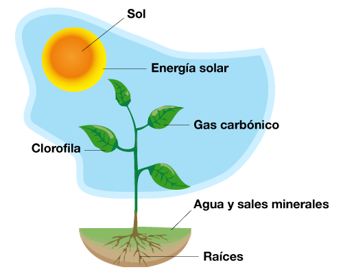
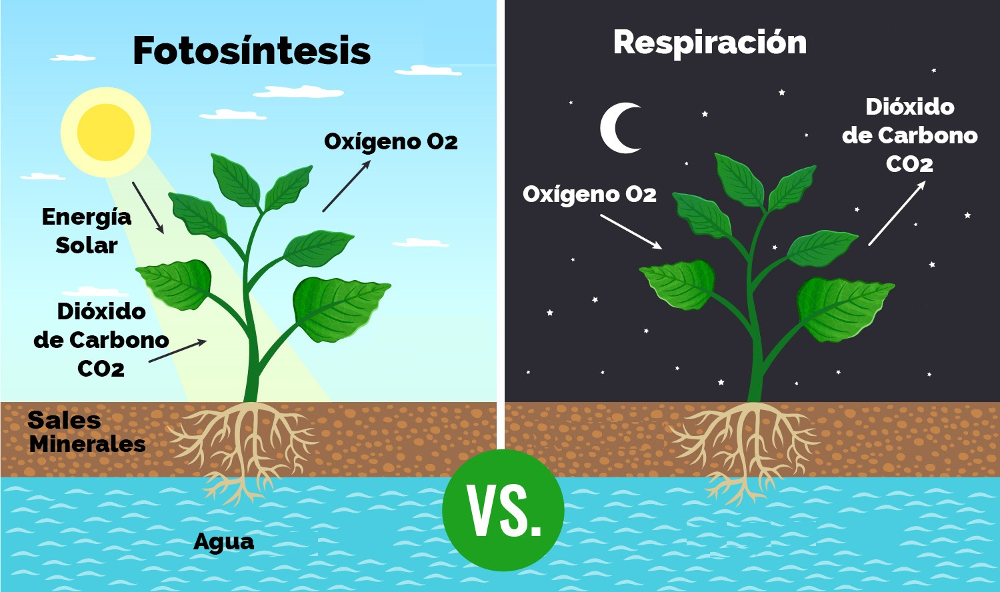

# LOS PROCESOS FISIOLÓGICOS

## La fotosíntesis

La **fotosíntesis** se puede definir como el proceso mediante el cual los vegetales provistos de clorofila sintetizan o forman su propia materia orgánica a partir del agua y del anhídrido carbónico. La energía necesaria para este proceso es tomada de la luz del sol, por tanto la fotosíntesis no se realiza en la oscuridad.

El agua y las sales minerales absorbidos por la raíz constituyen la savia bruta. Esta es transportada a través del xilema hasta las hojas y otras partes de la planta, donde tiene lugar una función muy importante llamada fotosíntesis, mediante la cual el vegetal elabora la materia orgánica (glucosa, comida para las plantas). Una vez realizada la fotosíntesis, se distribuye la savia elaborada a través del floema a todas las partes de la planta.

Como ideas generales respecto a la fotosíntesis nos quedaremos con que las plantas:

+ Consumen dióxido de carbono, gas perjudicial
+ Producen oxígeno, gas beneficioso y fundamental para la respiración de todos los seres vivos.
+ Fabrican hidratos de carbono, energía que se utiliza para su alimentación y su desarrollo.

## Absorción de agua y nutrientes

La planta absorbe agua y sales minerales que hay en la tierra a través de la raíz.

La raíz es la parte del eje de la planta cuya función consiste en fijarla a la tierra y absorber el agua y sales minerales necesarias para su nutrición. Esta sustancia forma lo que se llama savia bruta.

Las raíces toman el agua y los minerales que viajarán a lo largo del tallo y de las ramas hasta llegar a las hojas donde, los productos resultantes de la fotosíntesis, sufren una serie de reacciones y dan lugar a lo que se conoce como savia elaborada.

## Respiración

La respiración, al contrario que la fotosíntesis, tiene lugar de día y de noche. Esto se debe a que necesitan tener energía las 24h del día. 

Durante el proceso de respiración, las plantas absorben el oxígeno del aire. Entonces, transforma el oxígeno y los nutrientes en energía. 
Finalmente, la planta expulsa dióxido de carbono y vapor de agua en el aire. 

## Transpiración

La transpiración elimina el exceso de agua en forma de vapor por las estomas, pequeños orificios microscópicos situados en el reverso de las hojas.

Disponen de un mecanismo que les permite abrirse o cerrarse, de acuerdo con el agua que la planta necesita, y eliminar el sobrante en forma de vapor.

!!!nota "Nota: Deseo que los apuntes sean de mucha utilidad"