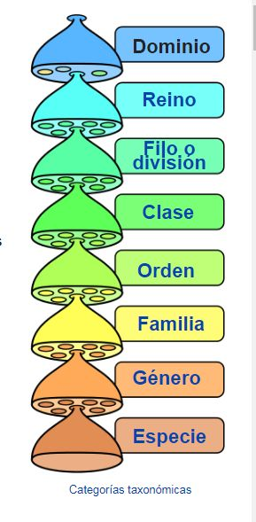
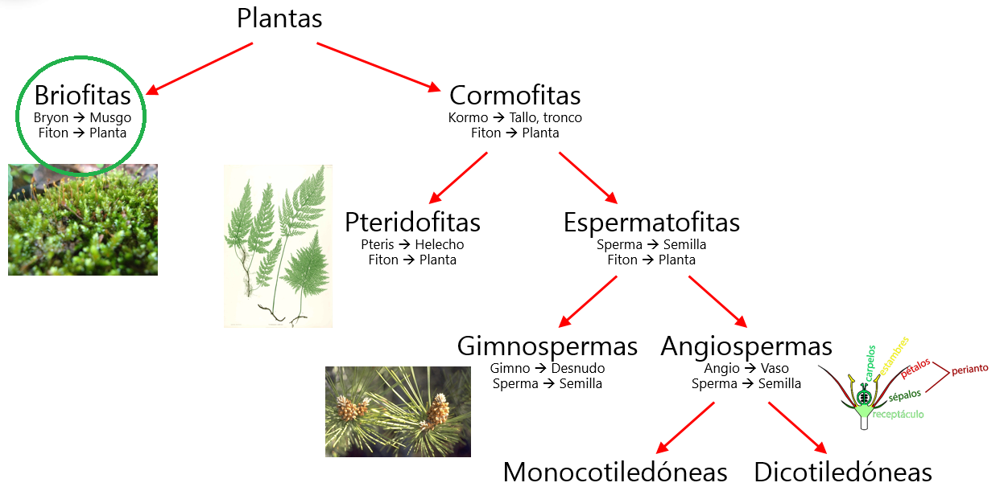

# TAXONOMÍA VEGETAL

## Concepto

La Taxonomía es la parte de La biología que se ocupa de la clasificación u ordenación de los organismos, así como normas que regulan dicha clasificación.
Las plantas se ordenan en distintos grupos o categorías taxonómicas de acuerdo con las afinidades que presentan. Las divisiones taxonómicas son: reino, división, clase, orden, familia, género y especie.

|        | **Pino Canario** | **Manzano** |
|--------|:-----------------:|:-----------:|
|REINO:  |Plantae            |Plantae      |
|DIVISIÓN:|Pinophyta         |Magnoliophyta|    
|CLASE:   |Pinopsida         |Magnoliopsida|   
|ORDEN:   |Pinales           |Rosales      |   
|FAMILIA: |Pinaceae          |Rosaceae     |   
|GÉNERO:  |Pinus             |Malus        |   
|ESPECIE: |Pinus canariensis C.Sm|Malus domestica Borkh|

Table: Ordenación de plantas

La especie se nombra utilizando la nomenclatura binomial que es un nombre latín que se escribe en cursiva y consta de dos partes, el primero es el género y el segundo la especie. Los nombres científicos siempre se escriben en latín y en cursiva. 

## Clasificación de las plantas

La clasificación de las especies desde un punto de vista morfológico es:

* **BRIOFITAS**: tienen aparato vegetativo con organización de alga, tejidos y vasos son rudimentarios.

* **CORMOFITAS O TRAQUEOFITAS**: Son plantas vasculares, tienen vasos por donde circula la savia bruta y la savia elaborada. Se clasifican en:  [Vídeo](https://www.youtube.com/watch?v=czVebW3Pf8k)
  * *CRIPTÓGAMAS, ESPORAFITAS O PTERIDOFITAS*: son plantas que no tienen semillas, flores ni frutos y se reproducen por esporas. Por ejemplo helechos.
 Helecho

  * *FANERÓGAMAS O ESPERMATOFITAS*: son plantas que tienen flores. Es el grupo de plantas más evolucionado y el más importante para el ser humano. Se clasifican en: .   
    * Gimnospermas: árboles o arbustos con hojas en forma de agujas o escamas, son perennes. No producen verdades flores, por lo tanto no producen frutos. Son siempre plantas leñosas. Ej. pino, abeto, ciprés, enebro

    * Angiospermas: plantas que pueden ser herbáceas o leñosas con hojas anchas, semillas, flores y frutos. Éstas se dividen en dos clases:
      * Monocotiledóneas: la semilla tiene un solo cotiledón: cebolla, arroz, maíz...
      * Dicotiledóneas: la semilla tiene dos cotiledones (primeras hojas del embrión): manzana, tomate, naranja...

